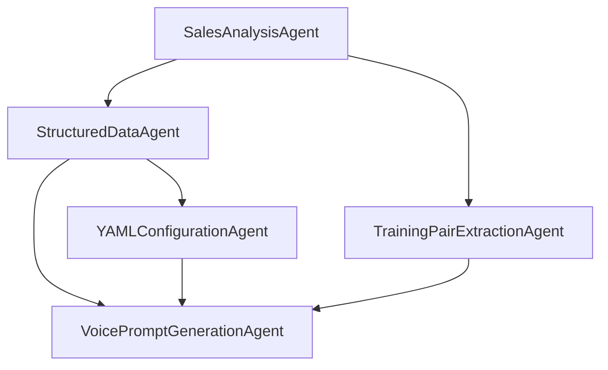

# Director Agents

## Overview
The Director framework implements a multimodal agentic architecture for advanced prompt and conversational pathway generation in AI voice agent implementations. The system uses specialized agents that work together to analyze, structure, and generate sophisticated conversational experiences.

## Agent Architecture

### Core Analysis Layer
1. **SalesAnalysisAgent**
   - Analyzes sales conversations for patterns and insights
   - Extracts key communication elements
   - Provides structured analysis output

2. **TrainingPairExtractionAgent**
   - Extracts high-quality input-output pairs
   - Generates training metadata
   - Supports model fine-tuning

### Configuration Layer
1. **YAMLConfigurationAgent**
   - Generates hierarchical YAML configurations
   - Handles system, voice, and training settings
   - Maintains configuration versioning

2. **StructuredDataAgent**
   - Converts analysis into structured formats
   - Generates LLM-optimized data structures
   - Supports multiple output formats

### Voice Generation Layer
1. **VoicePromptGenerationAgent**
   - Creates dynamic voice prompts
   - Adapts to conversation context
   - Supports flexible response patterns

### Integration Layer
1. **ConversationPathwayAgent** (Planned)
   - Manages conversation flows
   - Handles branching dialogues
   - Supports dynamic adaptation

2. **CrossAgentCommunication** (Planned)
   - Coordinates agent interactions
   - Manages data flow
   - Handles error propagation

## Agent Interactions



## Key Features
- Flexible voice prompt generation
- Advanced pathway management
- Cross-agent communication
- Hierarchical configuration
- Training data extraction
- Structured analysis

## Usage

### Basic Implementation
```python
from director.agents import (
    SalesAnalysisAgent,
    StructuredDataAgent,
    YAMLConfigurationAgent,
    VoicePromptGenerationAgent
)

# Initialize agents
sales_agent = SalesAnalysisAgent(session)
structured_agent = StructuredDataAgent(session)
yaml_agent = YAMLConfigurationAgent(session)
voice_agent = VoicePromptGenerationAgent(session)

# Process conversation
analysis = sales_agent.run(conversation_text)
structured_data = structured_agent.run(analysis.data)
config = yaml_agent.run(analysis.data, structured_data.data)
voice_prompt = voice_agent.run(config.data)
```

### Advanced Features
- Dynamic conversation pathways
- Real-time adaptation
- Cross-agent optimization
- Training data generation
- Configuration management

## Development Status

### Implemented
- [x] SalesAnalysisAgent
- [x] StructuredDataAgent
- [x] YAMLConfigurationAgent
- [x] TrainingPairExtractionAgent

### In Progress
- [ ] VoicePromptGenerationAgent
- [ ] ConversationPathwayAgent
- [ ] Cross-agent communication framework

## Contributing
When implementing new agents:
1. Follow the BaseAgent interface
2. Implement required methods
3. Add comprehensive testing
4. Update documentation
5. Maintain backward compatibility

## Future Roadmap
1. Enhanced cross-agent communication
2. Advanced pathway management
3. Real-time adaptation capabilities
4. Extended training data generation
5. Improved configuration management 