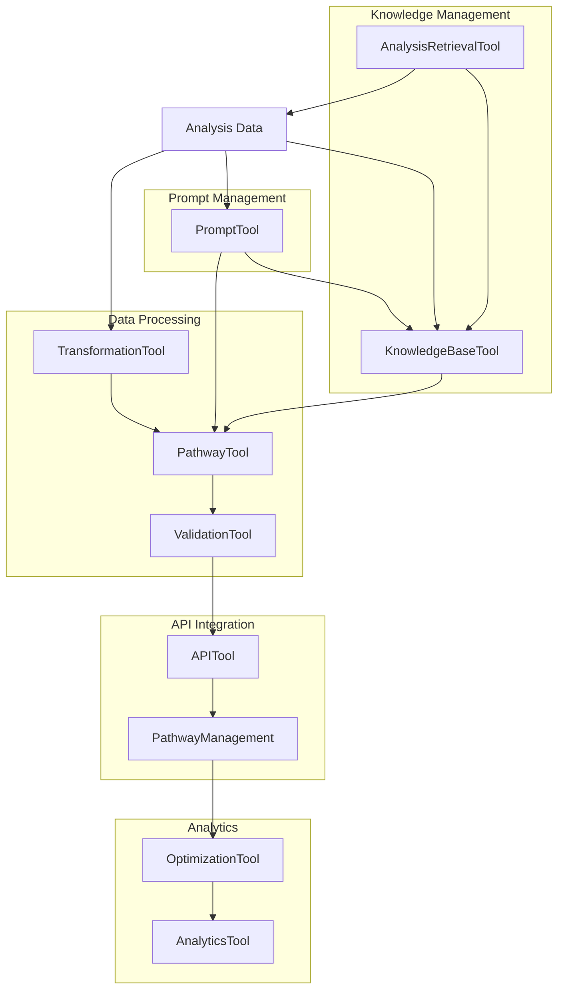

# Bland AI Tool Restructuring and Roadmap

## Current Implementation Analysis

### Core Architecture Components
- **BlandAI_Agent**: Main agent handling conversation pathways
- **SalesPathwayTransformer**: Transforms analysis data into pathway format
- **BlandAIIntegrationHandler**: Manages API interactions
- **BlandAIService**: Core service layer for Bland AI operations

### Tool Integration Assessment
Current implementation has several areas for improvement:
- Heavy reliance on direct service calls rather than modular tools
- Missing dedicated tools for key operations
- Limited separation between tools and services
- Insufficient error handling and validation

### Missing Tool Components
1. Pathway transformation tools
2. Node/edge generation utilities
3. API endpoint interaction tools
4. Validation and verification tools
5. Error handling and retry mechanisms

## Implementation Roadmap

### Phase 1: Tool Restructuring (1-2 weeks)

#### BlandAIPathwayTool
```typescript
interface PathwayTool {
  generateNodes(data: AnalysisData): Node[];
  createEdges(nodes: Node[]): Edge[];
  validatePathway(pathway: Pathway): ValidationResult;
  verifyStructure(pathway: Pathway): VerificationResult;
}
```

#### BlandAITransformationTool
```typescript
interface TransformationTool {
  convertAnalysis(analysis: Analysis): PathwayData;
  mapDataStructures(data: any): MappedData;
  validateFormat(data: any): ValidationResult;
  enforceSchema(data: any): SchemaResult;
}
```

#### BlandAIValidationTool
```typescript
interface ValidationTool {
  validateInput(input: any): ValidationResult;
  verifyOutput(output: any): VerificationResult;
  checkSchemaCompliance(data: any): ComplianceResult;
  detectErrors(data: any): ErrorReport;
}
```

#### BlandAIKnowledgeBaseTool
```typescript
interface KnowledgeBaseTool {
  createKnowledgeBase(name: string, description: string): Promise<string>; // Returns KB ID
  uploadAnalysis(kbId: string, analysisData: AnalysisData): Promise<void>;
  attachToNode(nodeId: string, kbId: string): Promise<void>;
  listKnowledgeBases(): Promise<KnowledgeBase[]>;
  getKnowledgeBase(kbId: string): Promise<KnowledgeBaseDetails>;
  deleteKnowledgeBase(kbId: string): Promise<void>;
}

interface KnowledgeBase {
  id: string;
  name: string;
  description: string;
  created_at: string;
  updated_at: string;
}

interface KnowledgeBaseDetails extends KnowledgeBase {
  content_type: string;
  size: number;
  metadata: Record<string, any>;
}

#### AnalysisRetrievalTool
```typescript
interface AnalysisRetrievalTool {
  getAnalysis(analysisId: string): Promise<Analysis>;
  validateAnalysis(analysisId: string): Promise<ValidationResult>;
  ensureAnalysisAvailable(analysisId: string): Promise<boolean>;
  attachAnalysisToSession(analysisId: string, sessionId: string): Promise<void>;
  getLatestAnalysis(sessionId: string): Promise<Analysis>;
}

interface Analysis {
  id: string;
  content: AnalysisContent;
  metadata: AnalysisMetadata;
  status: 'available' | 'processing' | 'error';
  created_at: string;
}

interface AnalysisContent {
  raw_analysis: string;
  structured_data: Record<string, any>;
  voice_prompt: string;
  yaml_config: string;
}

interface AnalysisMetadata {
  video_id: string;
  collection_id: string;
  analysis_type: string;
  processing_status: string;
}

#### BlandAIPromptTool
```typescript
interface PromptTool {
  // Core prompt operations
  createPrompt(name: string, content: string, options?: PromptOptions): Promise<string>; // Returns prompt ID
  getPrompt(promptId: string): Promise<PromptDetails>;
  updatePrompt(promptId: string, content: string, options?: PromptOptions): Promise<void>;
  deletePrompt(promptId: string): Promise<void>;
  listPrompts(): Promise<Prompt[]>;
  
  // Voice prompt specific operations
  saveVoicePrompt(analysisId: string, voicePrompt: string): Promise<string>; // Returns prompt ID
  linkPromptToPathway(promptId: string, pathwayId: string): Promise<void>;
  getLinkedPrompts(pathwayId: string): Promise<PromptDetails[]>;
  
  // Prompt management
  validatePrompt(content: string): Promise<ValidationResult>;
  clonePrompt(promptId: string, newName?: string): Promise<string>;
  getPromptVersion(promptId: string, version?: number): Promise<PromptVersion>;
}

interface Prompt {
  id: string;
  name: string;
  created_at: string;
  updated_at: string;
  version: number;
}

interface PromptDetails extends Prompt {
  content: string;
  metadata: PromptMetadata;
  linked_pathways: string[];
  usage_stats: PromptUsageStats;
}

interface PromptOptions {
  description?: string;
  tags?: string[];
  category?: string;
  metadata?: Record<string, any>;
}

interface PromptMetadata {
  analysis_id?: string;
  source_type: 'voice_prompt' | 'manual' | 'generated';
  version_history: PromptVersion[];
  tags: string[];
}

interface PromptVersion {
  version: number;
  content: string;
  created_at: string;
  created_by: string;
  changes?: string;
}

interface PromptUsageStats {
  total_uses: number;
  last_used: string;
  pathway_usage: Record<string, number>;
  success_rate?: number;
}

### Phase 2: Intelligent Pathway Creation (2-3 weeks)

#### PathwayGenerationTool
- Context-aware node creation
- Smart edge mapping
- Optimization algorithms
- Performance metrics

```typescript
interface PathwayGeneration {
  createContextualNodes(context: Context): Node[];
  mapEdgesIntelligently(nodes: Node[]): Edge[];
  optimizePathway(pathway: Pathway): OptimizedPathway;
  measurePerformance(pathway: Pathway): Metrics;
}
```

#### ConversationFlowTool
- Flow analysis capabilities
- Pattern detection
- Optimization suggestions
- Quality scoring system

```typescript
interface ConversationFlow {
  analyzeFlow(conversation: Conversation): FlowAnalysis;
  detectPatterns(data: ConversationData): Pattern[];
  suggestOptimizations(analysis: FlowAnalysis): Suggestion[];
  scoreQuality(conversation: Conversation): QualityScore;
}
```

### Phase 3: API Integration Enhancement (2-3 weeks)

#### BlandAIAPITool
```typescript
interface APITool {
  manageEndpoints(): EndpointManager;
  handleRateLimiting(): RateLimiter;
  processErrors(error: Error): ErrorHandler;
  implementRetry(operation: Operation): RetryHandler;
}
```

#### PathwayManagementTool
```typescript
interface PathwayManagement {
  crudOperations: CRUDHandler;
  versionControl: VersionManager;
  deploymentManagement: DeploymentHandler;
  statusTracking: StatusTracker;
}
```

### Phase 4: Advanced Features (3-4 weeks)

#### PathwayOptimizationTool
```typescript
interface PathwayOptimization {
  analyzePerformance(pathway: Pathway): PerformanceMetrics;
  conductABTesting(variants: Pathway[]): TestResults;
  trackMetrics(pathway: Pathway): MetricReport;
  suggestImprovements(analysis: PerformanceAnalysis): Improvements;
}
```

#### PathwayAnalyticsTool
```typescript
interface PathwayAnalytics {
  trackUsage(pathway: Pathway): UsageMetrics;
  measureSuccess(pathway: Pathway): SuccessMetrics;
  analyzeConversion(pathway: Pathway): ConversionRates;
  generateInsights(data: AnalyticsData): Insights;
}
```

## Implementation Considerations

### Tool Independence
- Self-contained functionality
- Clear interfaces
- Standardized I/O formats
- Comprehensive error handling

### Integration Points
- Seamless agent interaction
- Clear data flow
- Event handling
- Error recovery

### Performance Optimization
- Efficient transformations
- Optimized API usage
- Strategic caching
- Resource management

### Monitoring and Analytics
- Performance tracking
- Usage metrics
- Error logging
- Success rate monitoring

## Data Flow Architecture



## Testing Strategy

### Unit Testing
- Individual tool testing
- Interface verification
- Error handling validation
- Performance benchmarking

### Integration Testing
- Tool interaction testing
- Data flow validation
- API integration testing
- Error recovery testing

### Performance Testing
- Load testing
- Stress testing
- Scalability testing
- Resource utilization

### Monitoring
- Real-time performance tracking
- Error rate monitoring
- Usage analytics
- System health checks

## Future Enhancements

### AI Enhancement
- Machine learning for pathway optimization
- Automated pattern recognition
- Predictive analytics
- Self-healing capabilities

### Scalability
- Horizontal scaling
- Load balancing
- Distributed processing
- Cache optimization

### Security
- Enhanced authentication
- Data encryption
- Access control
- Audit logging

## Maintenance and Support

### Documentation
- API documentation
- Implementation guides
- Troubleshooting guides
- Best practices

### Monitoring
- System health checks
- Performance monitoring
- Error tracking
- Usage analytics

### Support
- Issue tracking
- Bug fixing
- Feature requests
- Version updates 