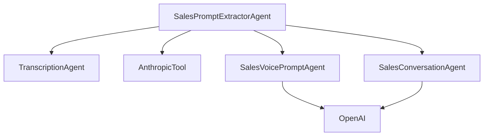

# Sales Analysis Agents

This documentation covers the sales analysis agents in the Director system.

## Overview

The sales analysis system consists of three main agents:

1. `SalesPromptExtractorAgent`: Main agent that analyzes sales videos and coordinates the analysis pipeline
2. `SalesVoicePromptAgent`: Generates AI voice agent prompts based on analysis
3. `SalesConversationAgent`: Generates example conversations demonstrating sales techniques

## Setup

### Environment Variables

Required environment variables:
```bash
ANTHROPIC_API_KEY=your_anthropic_key
OPENAI_API_KEY=your_openai_key
VIDEO_DB_API_KEY=your_videodb_key
VIDEO_DB_BASE_URL=https://api.videodb.io  # Optional, this is the default
```

### Dependencies

Add these to your requirements.txt:
```
anthropic>=0.7.0
openai>=1.0.0
videodb>=1.0.0
pydantic>=2.0.0
```

## Usage

### Basic Usage

```python
from director.core.session import Session
from director.agents.sales_prompt_extractor import SalesPromptExtractorAgent

# Initialize session
session = Session()

# Create agent
extractor = SalesPromptExtractorAgent(session=session)

# Run analysis
response = extractor.run(video_id="your_video_id")

# Access results
analysis_data = response.data
```

### Analysis Output

The analysis output contains:

1. Raw transcript
2. Structured analysis of:
   - Sales techniques used
   - Communication strategies
   - Objection handling approaches
   - Voice agent guidelines
3. AI voice agent prompts
4. Example conversations

### Error Handling

The agents handle errors gracefully and provide detailed error messages. Common errors:

- Missing API keys
- Invalid video ID
- Transcription failures
- Analysis timeouts

## Architecture



## Best Practices

1. Always check for required environment variables before running
2. Handle the session properly to maintain state
3. Use appropriate error handling
4. Monitor API usage and costs
5. Cache results when possible

## Limitations

1. Maximum video length depends on transcription service limits
2. API rate limits apply
3. Cost considerations for multiple API calls
4. Processing time varies with video length 