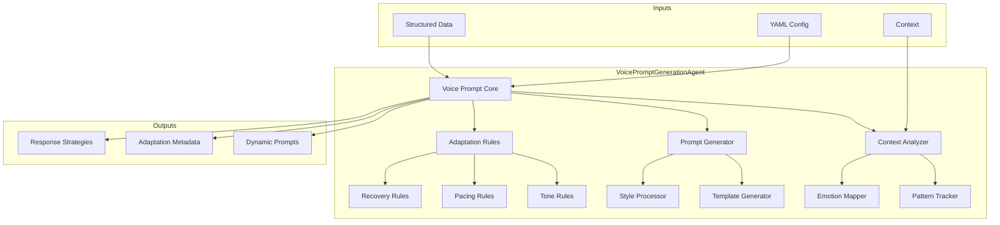
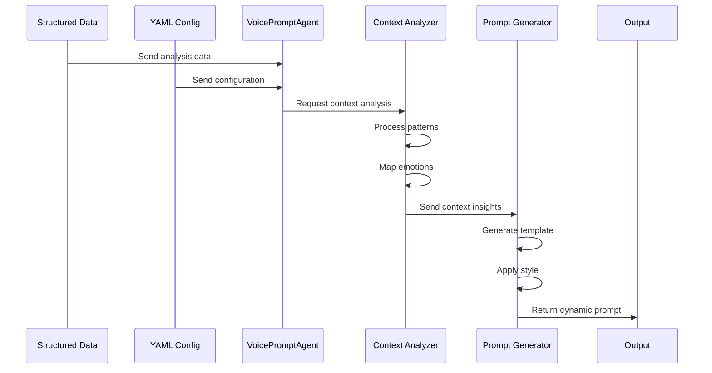

# Voice Prompt Generation Agent

## Overview
The VoicePromptGenerationAgent is responsible for creating dynamic, context-aware voice prompts that adapt to conversation flow while maintaining natural engagement. This agent represents a shift from rigid prompt structures to flexible, adaptive responses.

## Architecture

### Component Diagram


### Data Flow


## Core Components

### 1. Context Analyzer
- Processes conversation history
- Identifies interaction patterns
- Maps emotional states
- Tracks state transitions

### 2. Prompt Generator
- Creates dynamic templates
- Applies conversation styles
- Manages response variations
- Handles context transitions

### 3. Adaptation Rules Engine
- Tone adjustments
- Pacing guidelines
- Recovery strategies
- Context triggers

## Integration Points

### Input Interfaces
```python
{
    "structured_data": {
        "analysis_results": dict,
        "key_insights": list,
        "recommendations": dict
    },
    "yaml_config": {
        "voice_settings": dict,
        "adaptation_rules": dict,
        "style_guides": dict
    },
    "context": {
        "current_state": dict,
        "history": list,
        "preferences": dict
    }
}
```

### Output Format
```python
{
    "prompt_data": {
        "content": str,
        "style": str,
        "generated_at": datetime
    },
    "context_metadata": {
        "version": str,
        "analysis": dict,
        "adaptations": dict
    },
    "adaptation_rules": {
        "tone": dict,
        "pacing": dict,
        "recovery": dict
    }
}
```

## Usage Examples

### Basic Implementation
```python
from director.agents import VoicePromptGenerationAgent

# Initialize agent
voice_agent = VoicePromptGenerationAgent(session)

# Generate dynamic prompt
response = voice_agent.run(
    structured_data=analysis_data,
    yaml_config=config_data,
    context=conversation_context,
    style="dynamic"
)
```

### Advanced Usage
```python
# With custom adaptation rules
response = voice_agent.run(
    structured_data=analysis_data,
    yaml_config={
        "voice_settings": custom_voice_settings,
        "adaptation_rules": custom_rules,
        "style_guides": style_preferences
    },
    context={
        "current_state": current_conversation_state,
        "history": conversation_history,
        "preferences": user_preferences
    },
    style="professional"
)
```

## Configuration

### YAML Configuration Example
```yaml
voice_settings:
  tone:
    base_pitch: medium
    rate: moderate
    energy: balanced
  
  adaptation:
    emotion_mapping:
      positive:
        pitch: medium-high
        rate: moderate
        energy: high
      neutral:
        pitch: medium
        rate: moderate
        energy: medium
      negative:
        pitch: medium-low
        rate: slower
        energy: low

  recovery_strategies:
    clarification: maintain_context
    correction: smooth_redirect
    missing_info: natural_inquiry
```

## Error Handling

The agent implements comprehensive error handling:
1. Input validation
2. Context analysis failures
3. Prompt generation issues
4. Adaptation rule conflicts

## Testing

### Unit Tests
- Context analysis accuracy
- Pattern identification
- Emotion mapping
- Prompt generation
- Rule application

### Integration Tests
- Data flow validation
- Cross-component interaction
- Error propagation
- Performance metrics

## Future Enhancements

1. Enhanced Pattern Recognition
   - Deep learning integration
   - Historical pattern analysis
   - Behavioral prediction

2. Advanced Adaptation Rules
   - Dynamic rule generation
   - Context-specific adjustments
   - Learning from feedback

3. Improved Integration
   - Real-time adaptation
   - Cross-agent optimization
   - Performance monitoring

## Compatibility Notes

The VoicePromptGenerationAgent maintains compatibility with:
- Existing prompt structures
- Current agent interfaces
- Established workflows
- Data formats
``` 