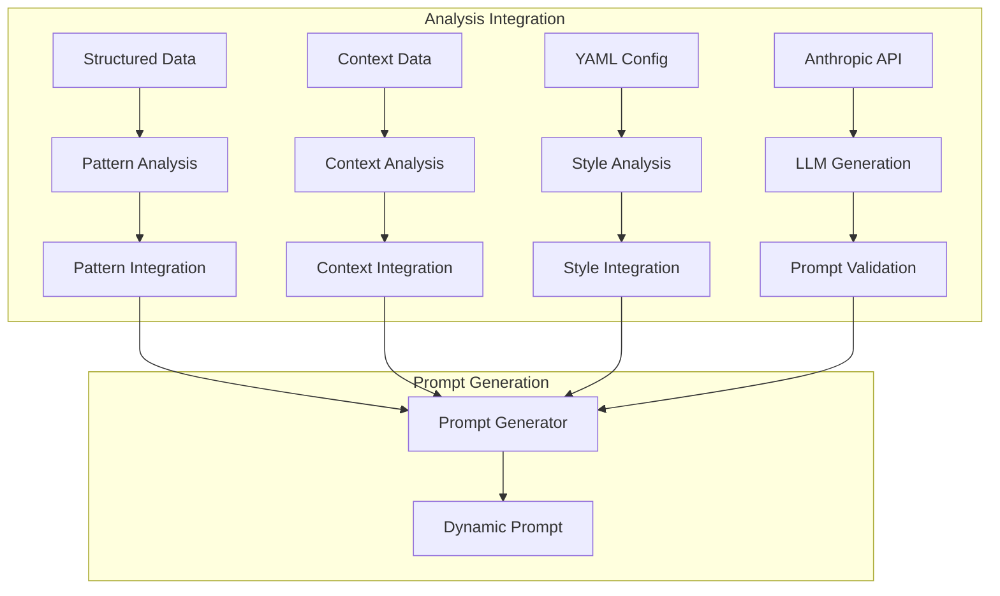

# Voice Prompt Generation - Prompt Engineering Guide

## Overview
This document details the prompt engineering approach for the VoicePromptGenerationAgent, focusing on leveraging the Anthropic API for expert prompt generation and analysis integration.

## Implementation Status

### Core Components
✅ Implemented and Tested:
- Agent initialization and configuration
- Analysis insights extraction
- Style configuration management
- Context analysis and adaptation
- Emotion mapping and tone adjustment
- Dynamic prompt generation
- Error handling and input validation
- VoicePromptContent serialization
- Anthropic API integration
- Basic testing framework

🔄 In Progress:
- Enhanced context adaptation
- Advanced pathways integration
- Cross-agent communication
- Performance optimization
- Extended test coverage

### Test Coverage
The following test scenarios are implemented and passing:

1. **Initialization Tests**
   - Agent initialization with mock LLM
   - Parameter validation
   - Anthropic API integration

2. **Analysis Tests**
   - Structured data extraction
   - Context analysis
   - Pattern recognition
   - Style configuration

3. **Emotion and Tone Tests**
   - Emotion to tone mapping
   - Style-specific configurations
   - Dynamic adaptations

4. **Integration Tests**
   - Successful prompt generation
   - Error handling
   - Input validation
   - Content serialization
   - Mock LLM responses

## Prompt Architecture

### System Role Definition
```python
SYSTEM_ROLE = """You are an expert voice prompt architect specializing in dynamic AI conversations.
Your core competencies include:
1. Sales psychology and conversation dynamics
2. Voice modulation and emotional resonance
3. Natural language pattern recognition
4. Adaptive response strategy design

Your responsibility is to generate voice prompts that are:
- Contextually aware and adaptive
- Emotionally intelligent and resonant
- Natural and conversational
- Style-consistent yet flexible
- Recovery-capable when needed
"""
```

### Output Format
```json
{
    "prompt": {
        "content": "The actual voice prompt content",
        "tone_guidance": {
            "pitch": "Specific pitch guidance",
            "rate": "Speech rate guidance",
            "energy": "Energy level guidance",
            "adaptations": {
                "context_based": ["Situational adjustments"],
                "emotion_based": ["Emotional adjustments"]
            }
        },
        "adaptation_rules": {
            "context_triggers": ["List of specific situations that trigger adaptations"],
            "response_patterns": ["Patterns for different response types"],
            "transitions": ["Natural transition phrases"],
            "recovery_strategies": ["Fallback options"]
        }
    },
    "metadata": {
        "style": "Style used",
        "context_awareness": ["Specific context elements addressed"],
        "emotional_resonance": ["Emotional aspects considered"],
        "generation_timestamp": "ISO timestamp",
        "version": "Agent version"
    }
}
```

### Analysis Integration


## Testing Framework

### Unit Tests
```python
class TestVoicePromptGenerationAgent:
    @pytest.fixture
    def mock_anthropic_tool(self):
        """Mock Anthropic API for testing"""
        return Mock(spec=AnthropicTool)
        
    def test_initialization(self, mock_anthropic_tool):
        """Test agent initialization with mock LLM"""
        
    def test_extract_analysis_insights(self, mock_anthropic_tool):
        """Test structured data extraction and analysis"""
        
    def test_get_style_config(self, mock_anthropic_tool):
        """Test style configuration generation"""
        
    def test_analyze_context(self, mock_anthropic_tool):
        """Test context analysis and adaptation"""
        
    def test_emotion_mapping(self, mock_anthropic_tool):
        """Test emotion to tone mapping"""
```

### Integration Tests
```python
class TestVoicePromptGenerationAgent:
    def test_run_success(self, mock_anthropic_tool):
        """Test successful prompt generation flow"""
        
    def test_run_error_handling(self, mock_anthropic_tool):
        """Test error handling and recovery"""
        
    def test_input_validation(self, mock_anthropic_tool):
        """Test input validation and error messages"""
```

## Example Usage

### Basic Prompt Generation
```python
# Initialize agent with Anthropic API
agent = VoicePromptGenerationAgent(session)

# Generate prompt with analysis integration
response = agent.run(
    structured_data=analysis_results,
    yaml_config=voice_config,
    context=conversation_context
)
```

## Next Steps
1. Enhance context adaptation capabilities
2. Implement advanced pathways integration
3. Expand test coverage
4. Optimize performance
5. Add more sophisticated recovery strategies
``` 