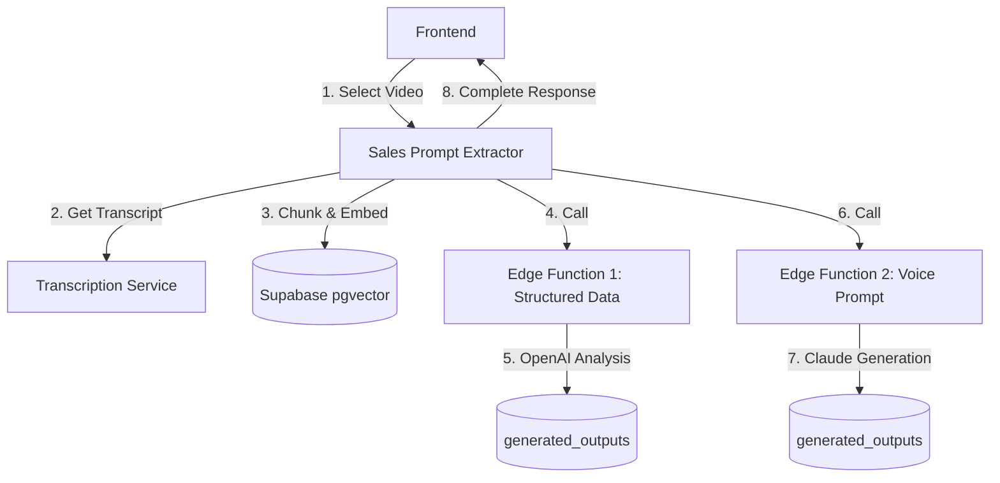
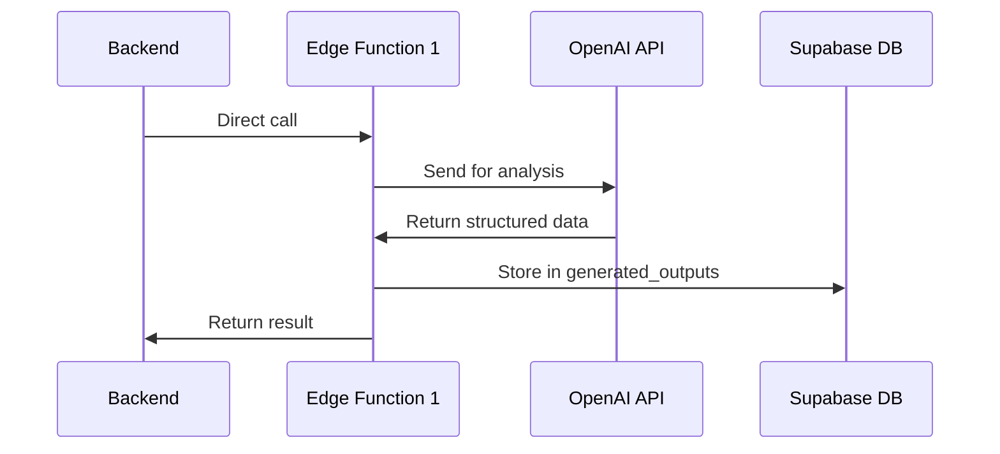
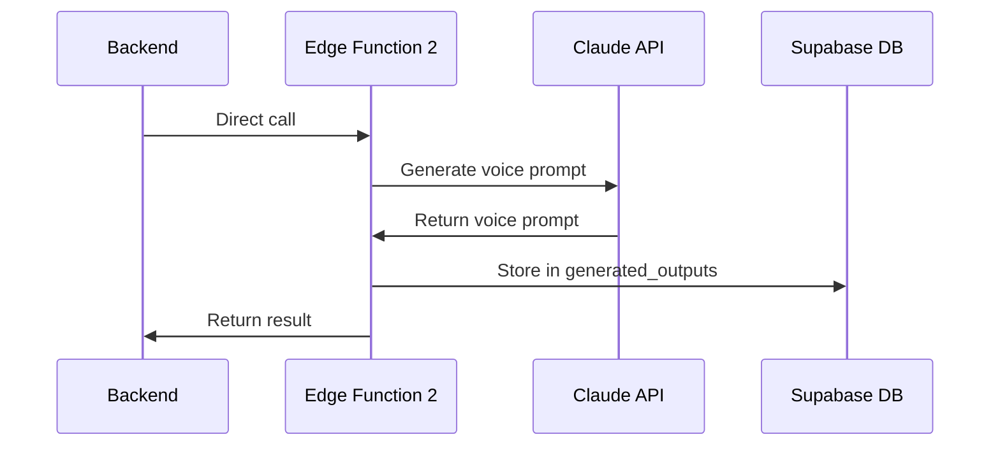
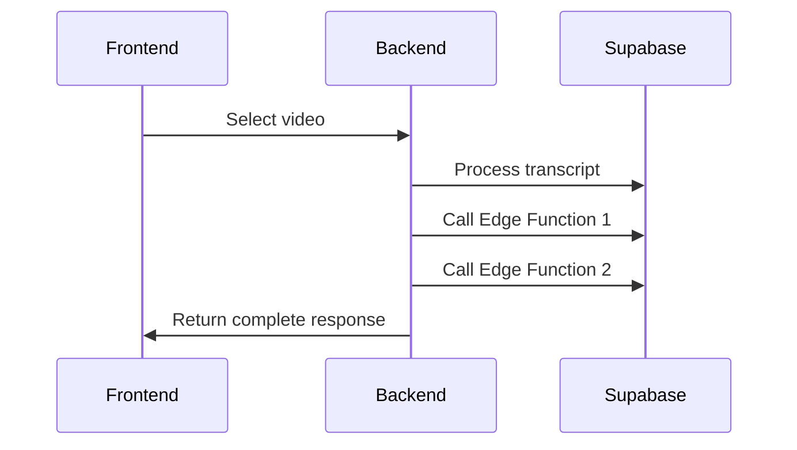
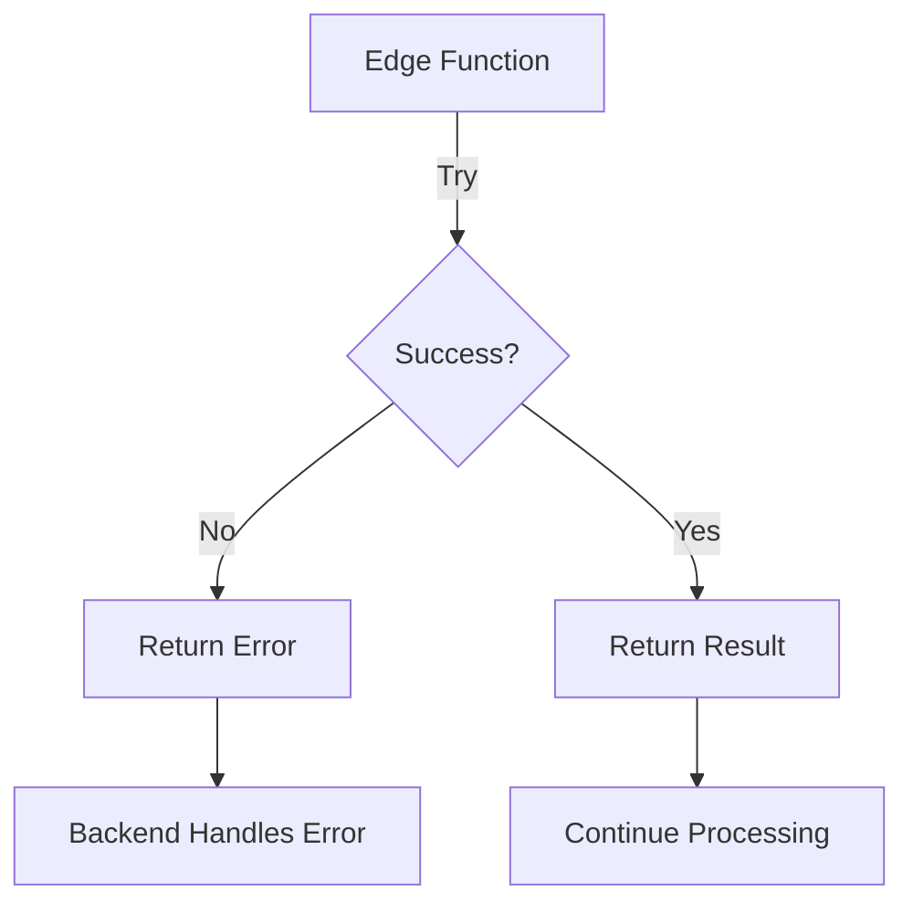

# Edge Functions Architecture for Sales Prompt Generation

## Overview
This document outlines the architecture and data flow for the sales prompt generation system using Supabase Edge Functions. The system processes sales conversations synchronously, utilizing Edge Functions for computationally intensive tasks while maintaining a synchronous request-response cycle.

## System Architecture



## Data Flow Stages

### 1. Initial Processing (Synchronous)
- Frontend selects video from collection
- `@sales_prompt_extractor` agent:
  - Retrieves video transcript
  - Chunks transcript into segments
  - Generates embeddings using OpenAI
  - Stores in Supabase pgvector
  - Waits for completion

### 2. Structured Data Generation (Synchronous)


- Direct call from backend
- Process:
  - Retrieves relevant transcript chunks
  - Sends to OpenAI for structured analysis
  - Stores result in `generated_outputs` table
  - Returns result to backend
  - Type: `structured_data`

### 3. Voice Prompt Generation (Synchronous)


- Direct call from backend
- Process:
  - Uses structured data from previous step
  - Sends to Claude for voice prompt generation
  - Stores result in `generated_outputs` table
  - Returns result to backend
  - Type: `voice_prompt`

## Database Schema

### videos
```sql
CREATE TABLE videos (
    id UUID PRIMARY KEY DEFAULT uuid_generate_v4(),
    video_id TEXT NOT NULL,
    collection_id TEXT NOT NULL,
    metadata JSONB,
    created_at TIMESTAMP WITH TIME ZONE DEFAULT CURRENT_TIMESTAMP,
    UNIQUE(video_id, collection_id)
);
```

### transcripts
```sql
CREATE TABLE transcripts (
    id UUID PRIMARY KEY DEFAULT uuid_generate_v4(),
    video_id UUID REFERENCES videos(id),
    full_text TEXT NOT NULL,
    metadata JSONB,
    created_at TIMESTAMP WITH TIME ZONE DEFAULT CURRENT_TIMESTAMP
);
```

### transcript_chunks
```sql
CREATE TABLE transcript_chunks (
    id UUID PRIMARY KEY DEFAULT uuid_generate_v4(),
    transcript_id UUID REFERENCES transcripts(id),
    chunk_text TEXT NOT NULL,
    chunk_index INTEGER NOT NULL,
    embedding vector(1536),
    metadata JSONB,
    created_at TIMESTAMP WITH TIME ZONE DEFAULT CURRENT_TIMESTAMP
);
```

### generated_outputs
```sql
CREATE TABLE generated_outputs (
    id UUID PRIMARY KEY DEFAULT uuid_generate_v4(),
    video_id UUID REFERENCES videos(id),
    output_type TEXT NOT NULL,
    content TEXT NOT NULL,
    metadata JSONB,
    created_at TIMESTAMP WITH TIME ZONE DEFAULT CURRENT_TIMESTAMP
);
```

## Frontend Integration



### Response Structure
```typescript
interface AnalysisResponse {
  status: 'success' | 'error';
  data: {
    analysis: string;
    structured_data: Record<string, any>;
    voice_prompt: string;
  };
  metadata: {
    processing_time: number;
    stages_completed: string[];
  };
}
```

## Error Handling

### Edge Function Error Handling


- Immediate error reporting
- No retry mechanism (handled by backend if needed)
- Detailed error information
- Transaction rollback if needed

## Monitoring and Logging

### Key Metrics
- Total processing time
- Time per processing stage
- API call success rates
- Error frequency by type

### Log Structure
```json
{
  "request_id": "uuid",
  "video_id": "uuid",
  "timestamp": "ISO-8601",
  "duration_ms": 1234,
  "stages": {
    "transcript_processing": {
      "status": "success",
      "duration_ms": 500
    },
    "structured_data": {
      "status": "success",
      "duration_ms": 400
    },
    "voice_prompt": {
      "status": "success",
      "duration_ms": 300
    }
  }
}
```

## Implementation Phases

### Phase 1: Edge Function Development
- Develop Edge Functions for structured data and voice prompt generation
- Implement proper error handling
- Add comprehensive logging

### Phase 2: Integration
- Integrate Edge Functions with existing synchronous flow
- Ensure proper error propagation
- Validate response times

### Phase 3: Testing
- Load testing
- Error scenario testing
- End-to-end flow validation

### Phase 4: Optimization
- Optimize Edge Function performance
- Fine-tune error handling
- Enhance monitoring 