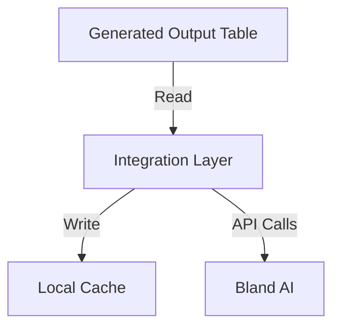
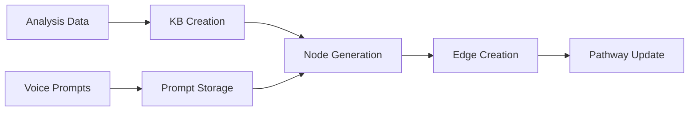
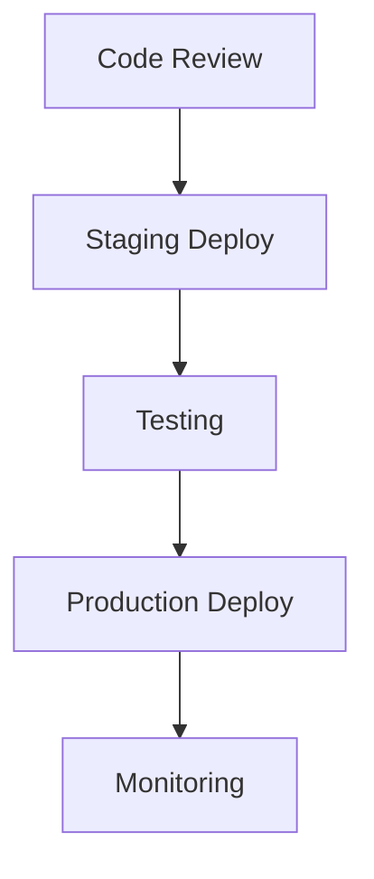

# Bland AI Implementation Plan

## Phase 1: Core Tool Development

### 1. Knowledge Base Tool Implementation
```python
# Priority: High
# Timeline: 2-3 days
class KnowledgeBaseTool:
    - Create KB from analysis text
    - Store KB metadata in local DB
    - Link KB to pathway nodes
    - Handle KB updates
```

### 2. Prompt Tool Implementation
```python
# Priority: High
# Timeline: 2-3 days
class PromptTool:
    - Store voice prompts
    - Handle prompt versioning
    - Manage prompt metadata
    - Link prompts to nodes
```

### 3. Node & Edge Tools Implementation
```python
# Priority: High
# Timeline: 3-4 days
class NodeTool:
    - Create KB nodes
    - Create prompt nodes
    - Handle node metadata
    - Manage node relationships

class EdgeTool:
    - Create edge connections
    - Handle edge types
    - Manage edge weights
    - Validate connections
```

## Phase 2: Integration Layer

### 1. Database Integration


### 2. API Client Implementation
```python
# Priority: Medium
# Timeline: 2-3 days
class BlandAIClient:
    - Handle authentication
    - Manage rate limits
    - Implement retry logic
    - Monitor API status
```

### 3. State Management
```python
# Priority: Medium
# Timeline: 2-3 days
class StateManager:
    - Track operation progress
    - Handle partial completions
    - Manage rollbacks
    - Store operation metadata
```

## Phase 3: Transformer Implementation

### 1. Core Transformation Logic


### 2. Validation Layer
```python
# Priority: High
# Timeline: 2-3 days
class ValidationManager:
    - Validate input data
    - Check node structure
    - Verify edge connections
    - Ensure pathway integrity
```

## Phase 4: Testing & Integration

### 1. Unit Tests
```python
# Priority: High
# Timeline: 2-3 days
- Test each tool independently
- Validate error handling
- Check edge cases
- Verify data transformations
```

### 2. Integration Tests
```python
# Priority: High
# Timeline: 2-3 days
- Test tool interactions
- Verify data flow
- Check error propagation
- Validate state management
```

### 3. End-to-End Tests
```python
# Priority: Medium
# Timeline: 2-3 days
- Test complete workflows
- Verify API integration
- Check error recovery
- Validate output
```

## Phase 5: Deployment & Monitoring

### 1. Deployment Steps


### 2. Monitoring Setup
```python
# Priority: Medium
# Timeline: 1-2 days
- Set up logging
- Configure alerts
- Track API usage
- Monitor performance
```

## Implementation Order

1. **Week 1**
   - Knowledge Base Tool
   - Prompt Tool
   - Basic API Client

2. **Week 2**
   - Node Tool
   - Edge Tool
   - State Management

3. **Week 3**
   - Transformer Implementation
   - Validation Layer
   - Unit Tests

4. **Week 4**
   - Integration Tests
   - End-to-End Tests
   - Deployment
   - Monitoring Setup

## Success Criteria

1. **Functionality**
   - Successfully create KBs from analysis
   - Properly store and manage prompts
   - Accurately create pathway structures
   - Handle updates without data loss

2. **Performance**
   - API response times < 2s
   - Successful retry rate > 95%
   - Error rate < 1%
   - Zero data loss

3. **Reliability**
   - System uptime > 99.9%
   - Successful pathway updates > 98%
   - Complete error recovery
   - Data consistency maintained

## Rollback Plan

```python
class RollbackManager:
    - Store operation checkpoints
    - Maintain previous states
    - Handle partial rollbacks
    - Ensure data consistency
```

## Dependencies

1. **External**
   - Bland AI API access
   - API rate limits
   - Authentication tokens

2. **Internal**
   - Generated output table
   - Sales analysis system
   - Database access
   - Socket.io server 