# Bland AI Integration Documentation

## Overview
This document outlines the integration between Director's Sales Prompt Extractor and Bland AI's Conversational Pathways system, enabling automated voice agent generation from analyzed sales conversations.

## Architecture

### High-Level System Flow
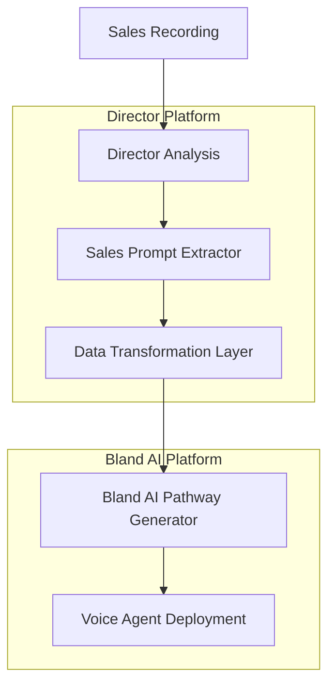

### Data Transformation Flow
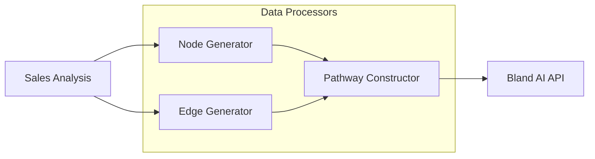

## Data Structure Mapping

### Input Structure (Director)
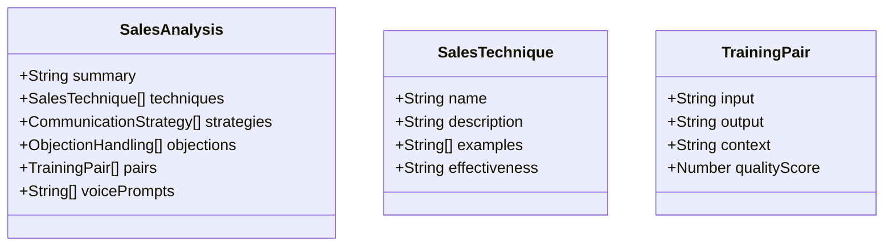

### Output Structure (Bland AI)
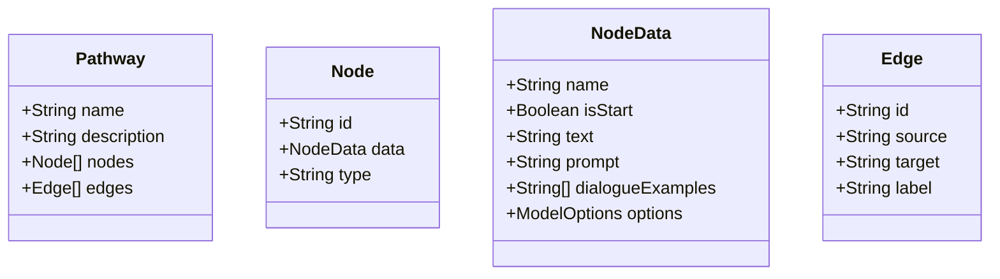

## Mapping Details

### Node Type Mappings
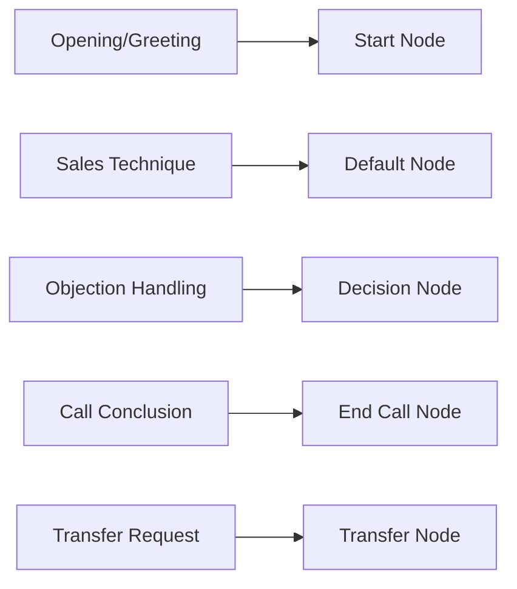

### Example Pathway Generation
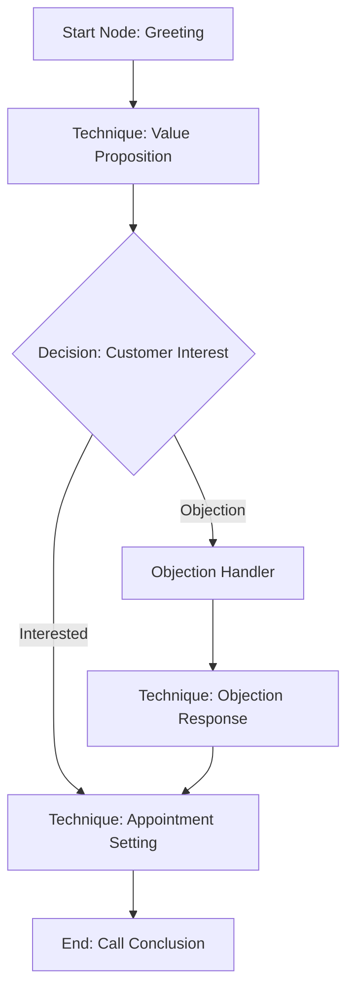

## API Integration Points

### Bland AI Endpoints
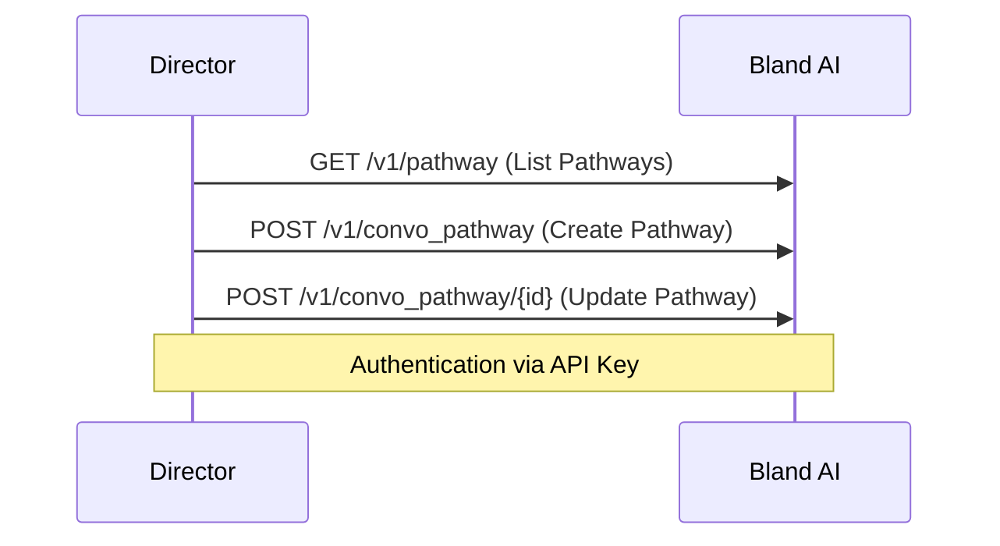

### Error Handling Flow
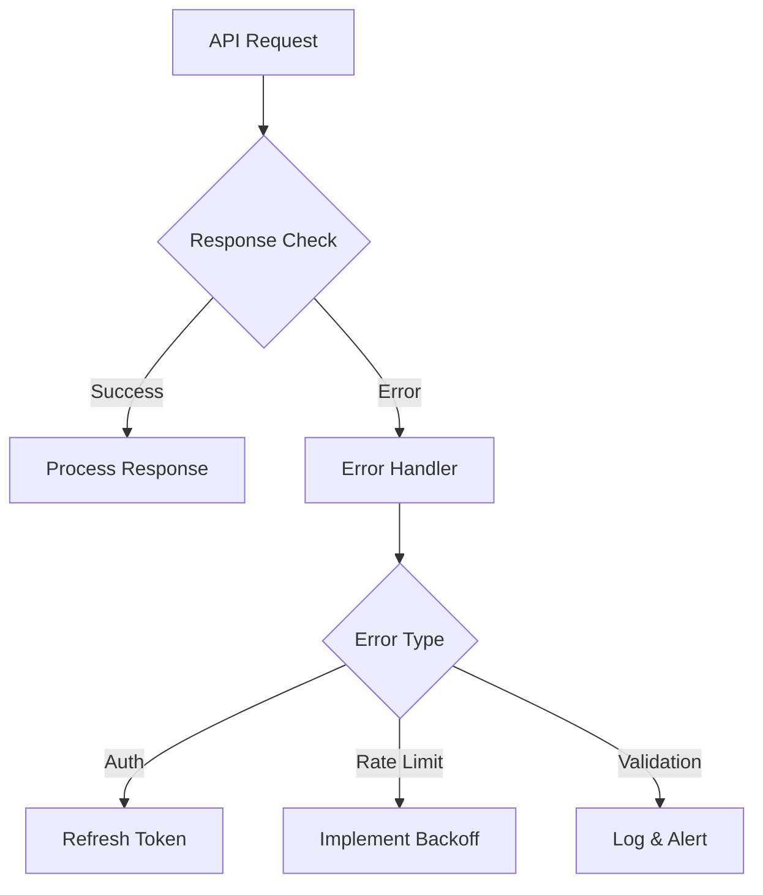

## Implementation Considerations

### Security
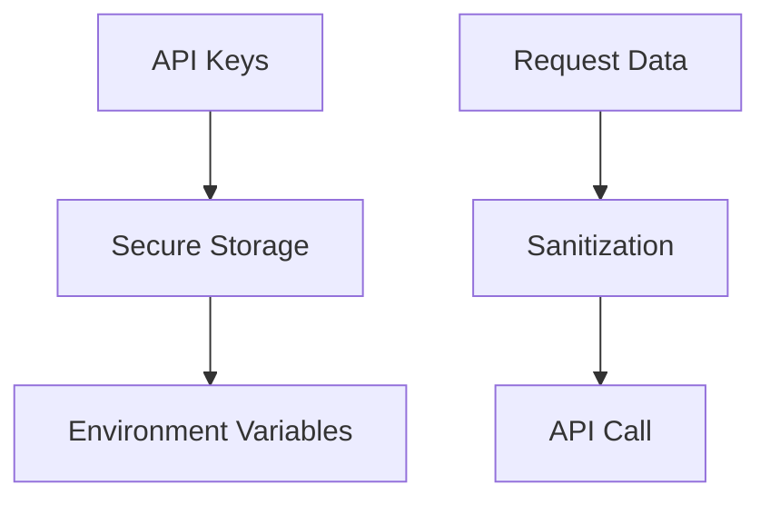

### Performance
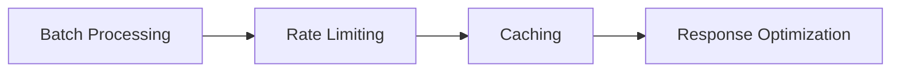

## Future Enhancements
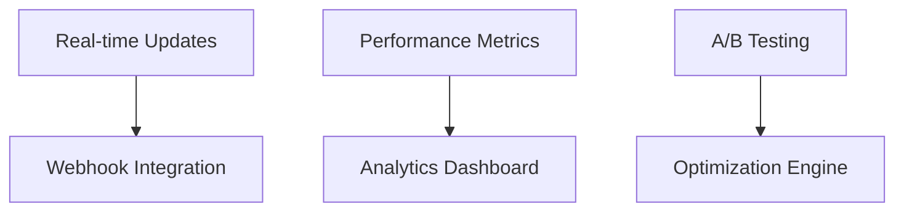

## Detailed API Integration Specifications

### Authentication
```typescript
interface AuthConfig {
    apiKey: string;
    headers: {
        'authorization': string;
        'Content-Type': 'application/json';
    }
}

// Environment Configuration
const BLAND_AI_CONFIG = {
    baseUrl: 'https://api.bland.ai',
    version: 'v1',
    apiKey: process.env.BLAND_AI_API_KEY
}
```

### API Endpoints Specification

#### 1. List Pathways
```typescript
// GET /v1/pathway
interface ListPathwaysResponse {
    pathways: Array<{
        pathway_id: string;
        name: string;
        description: string;
        nodes: Node[];
        edges: Edge[];
    }>;
}

async function listPathways(): Promise<ListPathwaysResponse> {
    endpoint: '/v1/pathway'
    method: 'GET'
    headers: AuthConfig.headers
}
```

#### 2. Create Pathway
```typescript
// POST /v1/convo_pathway
interface CreatePathwayRequest {
    name: string;
    description: string;
    nodes: {
        [nodeId: string]: {
            name: string;
            isStart?: boolean;
            type: 'Default' | 'End Call' | 'Transfer Node' | 'Knowledge Base';
            text?: string;
            prompt?: string;
            dialogueExamples?: string[];
            modelOptions?: {
                interruptionThreshold: number;
                temperature: number;
            };
        };
    };
    edges: {
        [edgeId: string]: {
            source: string;
            target: string;
            label: string;
        };
    };
}

interface CreatePathwayResponse {
    pathway_id: string;
    status: 'success' | 'error';
    message: string;
}
```

#### 3. Update Pathway
```typescript
// POST /v1/convo_pathway/{pathway_id}
interface UpdatePathwayRequest extends CreatePathwayRequest {
    pathway_id: string;
}

interface UpdatePathwayResponse {
    status: 'success' | 'error';
    message: string;
    pathway_data: {
        pathway_id: string;
        name: string;
        description: string;
        nodes: Node[];
        edges: Edge[];
    };
}
```

### Error Handling Implementation

```typescript
interface BlandAIError {
    status: number;
    code: string;
    message: string;
}

class BlandAIErrorHandler {
    static async handleError(error: BlandAIError): Promise<void> {
        switch (error.status) {
            case 401:
                // Authentication Error
                await this.handleAuthError(error);
                break;
            case 429:
                // Rate Limit Error
                await this.handleRateLimitError(error);
                break;
            case 400:
                // Validation Error
                await this.handleValidationError(error);
                break;
            default:
                await this.handleGenericError(error);
        }
    }

    private static async handleAuthError(error: BlandAIError): Promise<void> {
        logger.error('Authentication failed:', error);
        // Implement retry with refreshed credentials
        await this.refreshCredentials();
    }

    private static async handleRateLimitError(error: BlandAIError): Promise<void> {
        const backoffTime = this.calculateBackoff(error);
        logger.warn(`Rate limit exceeded. Backing off for ${backoffTime}ms`);
        await this.sleep(backoffTime);
    }

    private static async handleValidationError(error: BlandAIError): Promise<void> {
        logger.error('Validation error:', error);
        // Log detailed validation errors for debugging
        await this.logValidationDetails(error);
    }
}
```

### Request/Response Flow
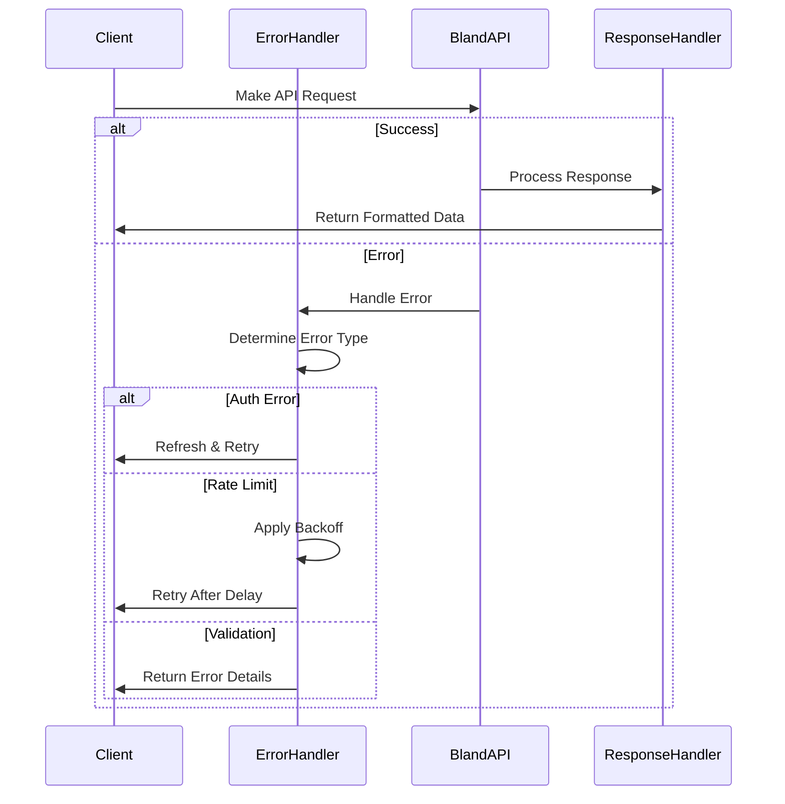

### Rate Limiting Implementation
```typescript
interface RateLimitConfig {
    maxRequests: number;
    windowMs: number;
    backoffMultiplier: number;
}

class RateLimiter {
    private queue: Array<() => Promise<any>> = [];
    private processing: boolean = false;
    private requestCount: number = 0;
    private windowStart: number = Date.now();

    async addToQueue<T>(request: () => Promise<T>): Promise<T> {
        return new Promise((resolve, reject) => {
            this.queue.push(async () => {
                try {
                    const result = await this.executeWithBackoff(request);
                    resolve(result);
                } catch (error) {
                    reject(error);
                }
            });
            this.processQueue();
        });
    }

    private async executeWithBackoff<T>(
        request: () => Promise<T>,
        retryCount: number = 0
    ): Promise<T> {
        try {
            return await request();
        } catch (error) {
            if (error.status === 429 && retryCount < this.config.maxRetries) {
                const backoffTime = this.calculateBackoff(retryCount);
                await this.sleep(backoffTime);
                return this.executeWithBackoff(request, retryCount + 1);
            }
            throw error;
        }
    }
}
```

### Response Caching
```typescript
interface CacheConfig {
    ttl: number;
    maxSize: number;
}

class ResponseCache {
    private cache: Map<string, {
        data: any;
        timestamp: number;
    }> = new Map();

    async get<T>(key: string): Promise<T | null> {
        const cached = this.cache.get(key);
        if (cached && !this.isExpired(cached.timestamp)) {
            return cached.data as T;
        }
        return null;
    }

    set(key: string, data: any): void {
        if (this.cache.size >= this.config.maxSize) {
            this.evictOldest();
        }
        this.cache.set(key, {
            data,
            timestamp: Date.now()
        });
    }
} 