# Bland AI Integration Documentation

## Overview
This document outlines the integration between Director's Sales Prompt Extractor and Bland AI's Conversational Pathways system, enabling automated voice agent generation from analyzed sales conversations.

## Architecture

### High-Level System Flow
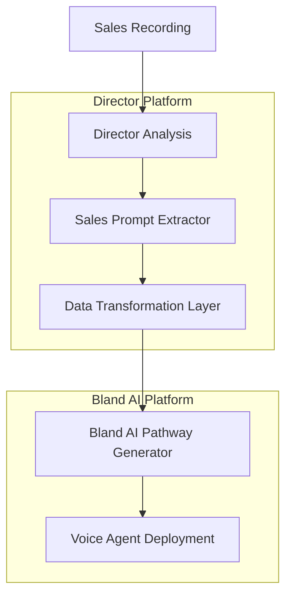

### Data Transformation Flow
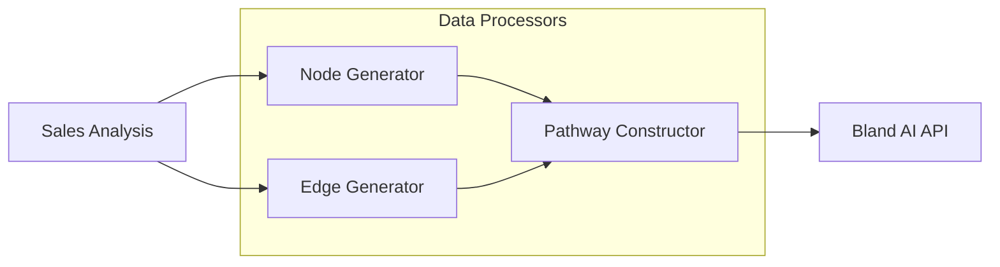

## Data Structure Mapping

### Input Structure (Director)
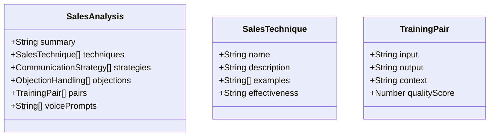

### Output Structure (Bland AI)
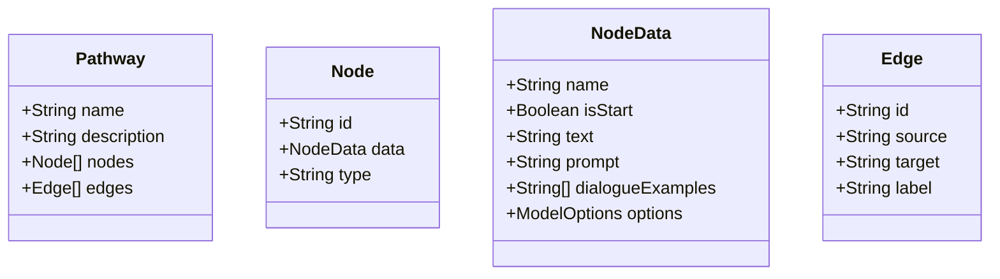

## Mapping Details

### Node Type Mappings
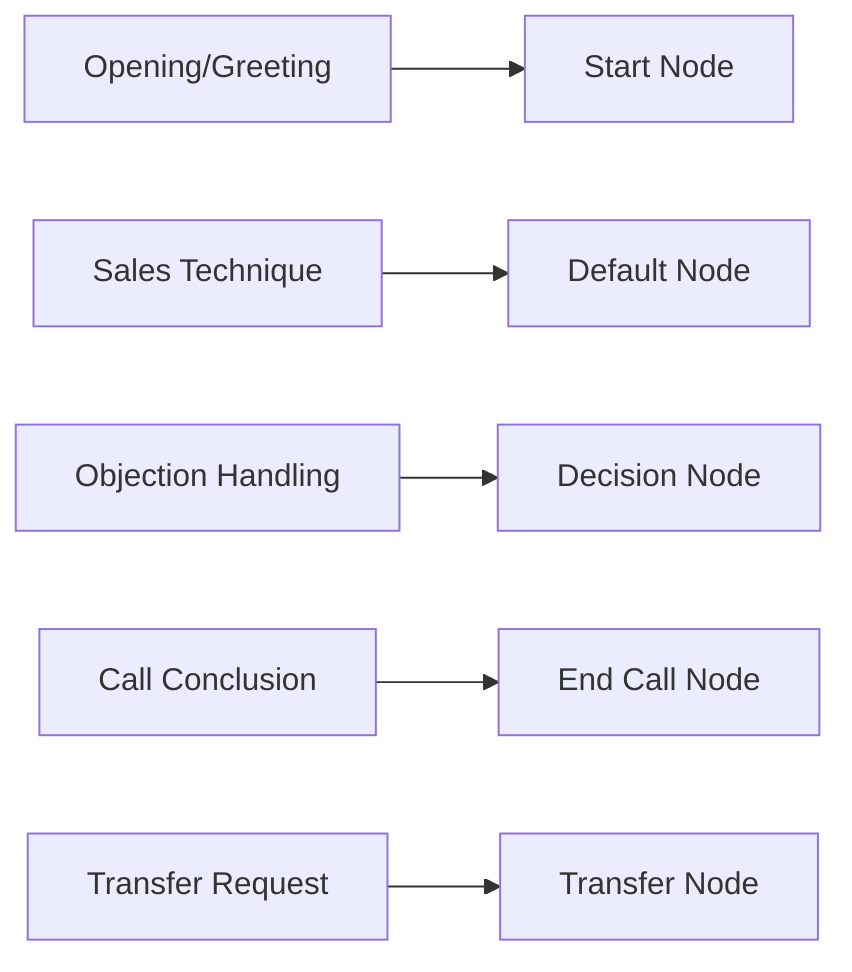

### Example Pathway Generation
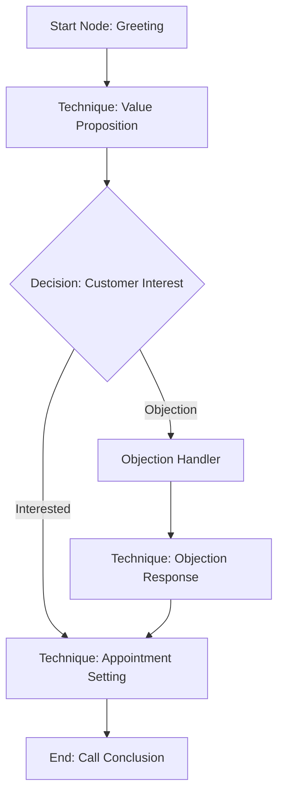

## API Integration Points

### Bland AI Endpoints
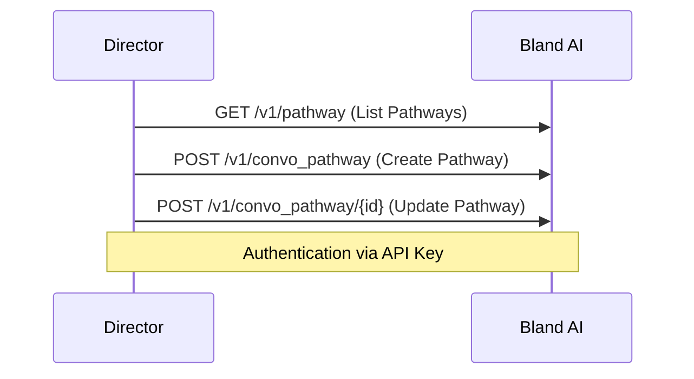

### Error Handling Flow
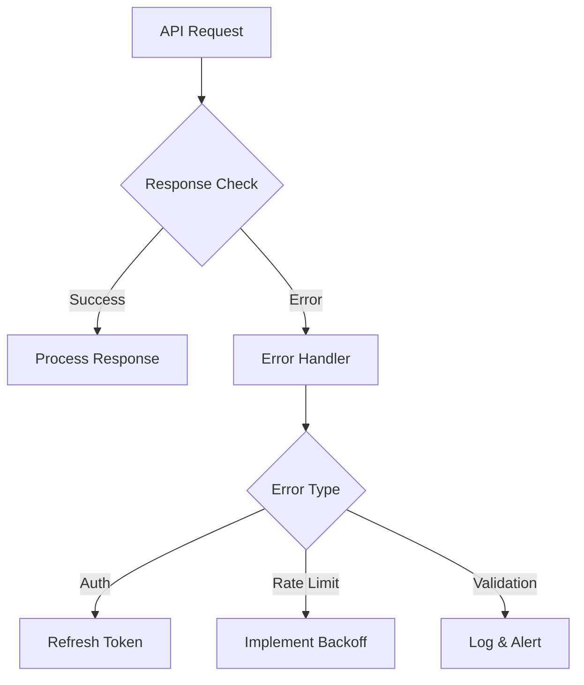

## Implementation Considerations

### Security
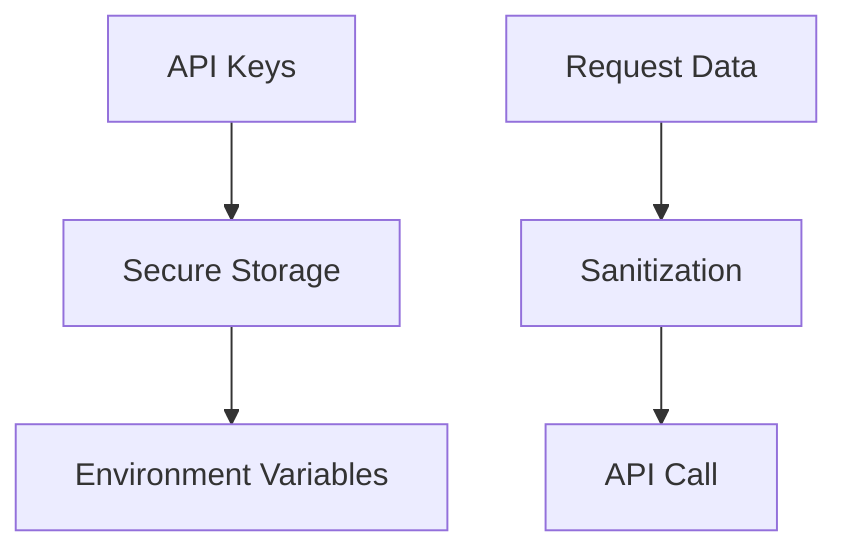

### Performance
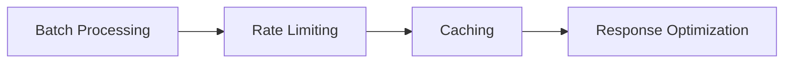

## Future Enhancements
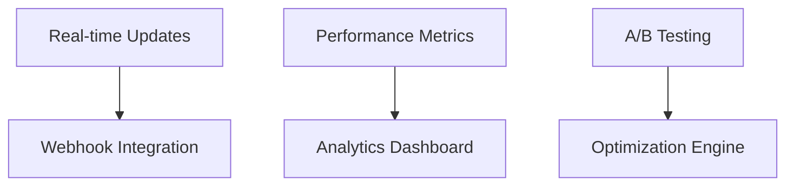

## Detailed API Integration Specifications

### Authentication
```typescript
interface AuthConfig {
    apiKey: string;
    headers: {
        'authorization': string;
        'Content-Type': 'application/json';
    }
}

// Environment Configuration
const BLAND_AI_CONFIG = {
    baseUrl: 'https://api.bland.ai',
    version: 'v1',
    apiKey: process.env.BLAND_AI_API_KEY
}
```

### API Endpoints Specification

#### 1. List Pathways
```typescript
// GET /v1/pathway
interface ListPathwaysResponse {
    pathways: Array<{
        pathway_id: string;
        name: string;
        description: string;
        nodes: Node[];
        edges: Edge[];
    }>;
}

async function listPathways(): Promise<ListPathwaysResponse> {
    endpoint: '/v1/pathway'
    method: 'GET'
    headers: AuthConfig.headers
}
```

#### 2. Create Pathway
```typescript
// POST /v1/convo_pathway
interface CreatePathwayRequest {
    name: string;
    description: string;
    nodes: {
        [nodeId: string]: {
            name: string;
            isStart?: boolean;
            type: 'Default' | 'End Call' | 'Transfer Node' | 'Knowledge Base';
            text?: string;
            prompt?: string;
            dialogueExamples?: string[];
            modelOptions?: {
                interruptionThreshold: number;
                temperature: number;
            };
        };
    };
    edges: {
        [edgeId: string]: {
            source: string;
            target: string;
            label: string;
        };
    };
}

interface CreatePathwayResponse {
    pathway_id: string;
    status: 'success' | 'error';
    message: string;
}
```

#### 3. Update Pathway
```typescript
// POST /v1/convo_pathway/{pathway_id}
interface UpdatePathwayRequest extends CreatePathwayRequest {
    pathway_id: string;
}

interface UpdatePathwayResponse {
    status: 'success' | 'error';
    message: string;
    pathway_data: {
        pathway_id: string;
        name: string;
        description: string;
        nodes: Node[];
        edges: Edge[];
    };
}
```

### Error Handling Implementation

```typescript
interface BlandAIError {
    status: number;
    code: string;
    message: string;
}

class BlandAIErrorHandler {
    static async handleError(error: BlandAIError): Promise<void> {
        switch (error.status) {
            case 401:
                // Authentication Error
                await this.handleAuthError(error);
                break;
            case 429:
                // Rate Limit Error
                await this.handleRateLimitError(error);
                break;
            case 400:
                // Validation Error
                await this.handleValidationError(error);
                break;
            default:
                await this.handleGenericError(error);
        }
    }

    private static async handleAuthError(error: BlandAIError): Promise<void> {
        logger.error('Authentication failed:', error);
        // Implement retry with refreshed credentials
        await this.refreshCredentials();
    }

    private static async handleRateLimitError(error: BlandAIError): Promise<void> {
        const backoffTime = this.calculateBackoff(error);
        logger.warn(`Rate limit exceeded. Backing off for ${backoffTime}ms`);
        await this.sleep(backoffTime);
    }

    private static async handleValidationError(error: BlandAIError): Promise<void> {
        logger.error('Validation error:', error);
        // Log detailed validation errors for debugging
        await this.logValidationDetails(error);
    }
}
```

### Request/Response Flow
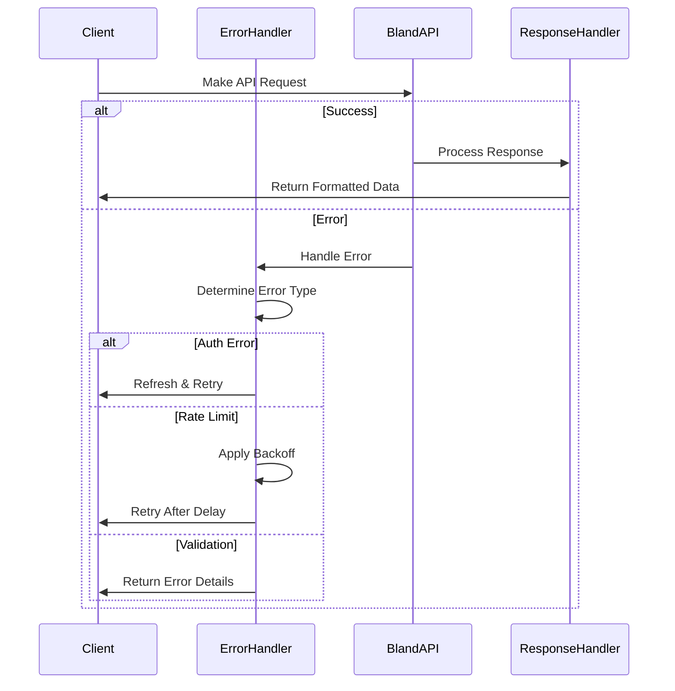

### Rate Limiting Implementation
```typescript
interface RateLimitConfig {
    maxRequests: number;
    windowMs: number;
    backoffMultiplier: number;
}

class RateLimiter {
    private queue: Array<() => Promise<any>> = [];
    private processing: boolean = false;
    private requestCount: number = 0;
    private windowStart: number = Date.now();

    async addToQueue<T>(request: () => Promise<T>): Promise<T> {
        return new Promise((resolve, reject) => {
            this.queue.push(async () => {
                try {
                    const result = await this.executeWithBackoff(request);
                    resolve(result);
                } catch (error) {
                    reject(error);
                }
            });
            this.processQueue();
        });
    }

    private async executeWithBackoff<T>(
        request: () => Promise<T>,
        retryCount: number = 0
    ): Promise<T> {
        try {
            return await request();
        } catch (error) {
            if (error.status === 429 && retryCount < this.config.maxRetries) {
                const backoffTime = this.calculateBackoff(retryCount);
                await this.sleep(backoffTime);
                return this.executeWithBackoff(request, retryCount + 1);
            }
            throw error;
        }
    }
}
```

### Response Caching
```typescript
interface CacheConfig {
    ttl: number;
    maxSize: number;
}

class ResponseCache {
    private cache: Map<string, {
        data: any;
        timestamp: number;
    }> = new Map();

    async get<T>(key: string): Promise<T | null> {
        const cached = this.cache.get(key);
        if (cached && !this.isExpired(cached.timestamp)) {
            return cached.data as T;
        }
        return null;
    }

    set(key: string, data: any): void {
        if (this.cache.size >= this.config.maxSize) {
            this.evictOldest();
        }
        this.cache.set(key, {
            data,
            timestamp: Date.now()
        });
    }
}

## Vector Knowledge Base Integration

### Overview
The Director platform integrates with Bland AI's Vector Knowledge Base system to store and retrieve sales analysis data. This enables AI agents to access relevant sales techniques, objection handling strategies, and training examples during conversations.

### Knowledge Base Structure
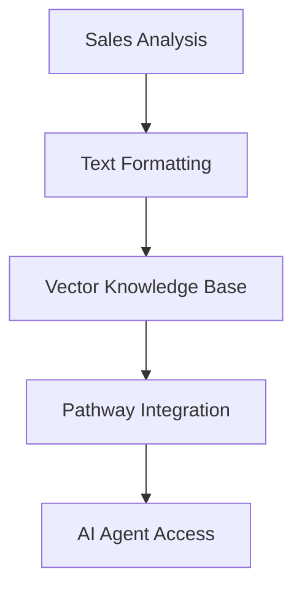

### Data Transformation
Sales analysis data is transformed into a structured text format:
```text
Summary:
[Analysis summary text]

Sales Techniques:
- [Technique Name]
  Description: [Technique description]
  Examples:
    * [Example 1]
    * [Example 2]
  Effectiveness: [Effectiveness rating]

Objection Handling:
- Objection: [Objection text]
  Response: [Response text]
  Examples:
    * [Example 1]
    * [Example 2]

Training Examples:
Input: [Customer input]
Output: [Agent response]
Context: [Interaction context]
```

### API Integration Points

#### Creating Knowledge Bases
- Endpoint: `POST /v1/knowledgebases`
- Used for creating new knowledge bases from sales analysis
- Supports text content with name and description

#### Updating Knowledge Bases
- Endpoint: `PATCH /v1/knowledgebases/{kb_id}`
- Used for updating existing knowledge bases
- Can update name, description, and text content

#### Listing Knowledge Bases
- Endpoint: `GET /v1/knowledgebases`
- Lists all available knowledge bases
- Optional `include_text` parameter for full content

#### Getting Knowledge Base Details
- Endpoint: `GET /v1/knowledgebases/{kb_id}`
- Retrieves specific knowledge base details
- Optional `include_text` parameter for full content

#### File Upload
- Endpoint: `POST /v1/knowledgebases/upload`
- Supports uploading .pdf, .txt, .doc, or .docx files
- Optional name and description parameters

### Usage in Pathways
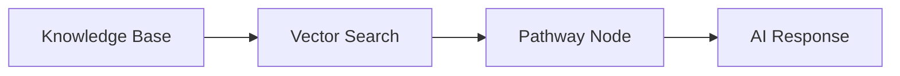

Knowledge bases are linked to conversation pathways through the `pathway_knowledge_bases` table, allowing AI agents to:
1. Access relevant sales techniques during conversations
2. Handle objections with proven strategies
3. Learn from successful training examples

### Implementation Details
- Knowledge bases are created automatically after sales analysis
- Each pathway can be linked to multiple knowledge bases
- Vector search is used to find relevant information during conversations
- Knowledge base updates maintain pathway links 

### Pathway Creation with Knowledge Base Integration

#### Creating a New Pathway
```typescript
interface CreatePathwayWithKBRequest {
    name: string;
    description: string;
    nodes: {
        [nodeId: string]: {
            name: string;
            isStart?: boolean;
            type: 'Default' | 'End Call' | 'Transfer Node' | 'Knowledge Base';
            text?: string;
            prompt?: string;
            dialogueExamples?: string[];
            tools?: string[];  // Array of knowledge base IDs to use
            modelOptions?: {
                interruptionThreshold: number;
                temperature: number;
            };
        };
    };
    edges: {
        [edgeId: string]: {
            source: string;
            target: string;
            label: string;
        };
    };
}
```

Example pathway with knowledge base:
```json
{
    "name": "Sales Agent with KB",
    "description": "Sales agent pathway with knowledge base integration",
    "nodes": {
        "start": {
            "name": "Greeting",
            "type": "Default",
            "isStart": true,
            "prompt": "Greet the customer warmly and introduce yourself",
            "tools": ["KB-55e64dae-1585-4632-ae97-c909c288c6bc"]
        },
        "value_prop": {
            "name": "Value Proposition",
            "type": "Default",
            "prompt": "Present our value proposition based on the knowledge base",
            "tools": ["KB-55e64dae-1585-4632-ae97-c909c288c6bc"]
        }
    },
    "edges": {
        "start_to_value": {
            "source": "start",
            "target": "value_prop",
            "label": "After greeting"
        }
    }
}
```

#### Knowledge Base Integration Flow
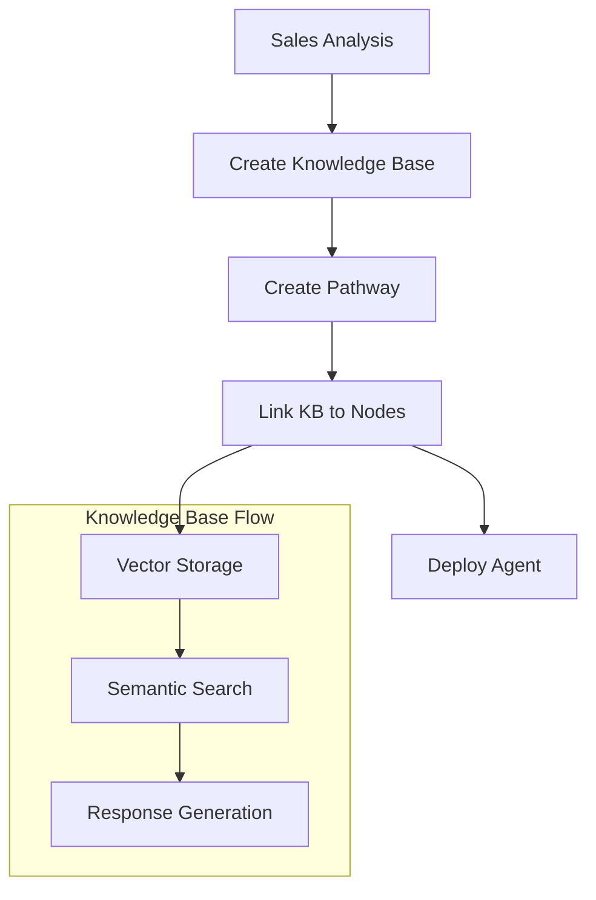

#### Updating Pathways with Knowledge Bases

1. **Adding Knowledge Base to Existing Node**
```typescript
interface UpdateNodeRequest {
    node_id: string;
    tools: string[];  // Add knowledge base IDs
}
```

2. **Updating Node with New Knowledge Base**
```typescript
interface UpdateNodeKBRequest {
    node_id: string;
    tools: string[];  // Replace existing knowledge base IDs
    prompt: string;   // Updated prompt to use KB
}
```

3. **Knowledge Base Usage in Nodes**
- Each node can access multiple knowledge bases
- Knowledge bases are queried based on conversation context
- Results are incorporated into response generation

Example node update:
```json
{
    "node_id": "value_proposition",
    "tools": ["KB-55e64dae-1585", "KB-98f76bcd-4321"],
    "prompt": "Use the knowledge base to find relevant sales techniques and present our value proposition. Consider: {context}"
}
```

### Knowledge Base Query Integration

#### Query Flow in Pathways
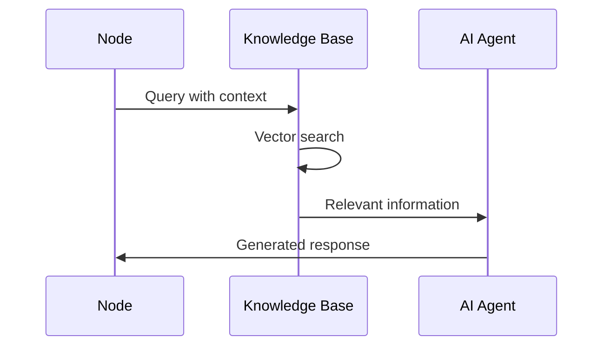

#### Query Parameters
```typescript
interface KBQueryParams {
    kb_id: string;
    query: string;
    top_k?: number;
    threshold?: number;
}
```

Example usage in node:
```typescript
const response = await queryKnowledgeBase({
    kb_id: "KB-55e64dae-1585",
    query: "customer objection about pricing",
    top_k: 3
});
```

### Implementation Best Practices

1. **Knowledge Base Selection**
   - Link relevant KBs to specific node types
   - Use multiple KBs for comprehensive coverage
   - Update KB links when content changes

2. **Query Optimization**
   - Use specific queries for better results
   - Cache frequent queries
   - Implement fallback responses

3. **Response Integration**
   - Blend KB results with predefined prompts
   - Maintain conversation context
   - Handle KB query failures gracefully 

### Pathway Updates

#### Overview
Pathway updates allow modification of existing conversation pathways, including:
- Node content and configuration
- Edge connections and flow
- Knowledge base integrations
- Prompt modifications

#### Update Operations

1. **Full Pathway Update**
```typescript
interface UpdatePathwayRequest {
    pathway_id: string;
    name?: string;           // Optional update to pathway name
    description?: string;    // Optional update to pathway description
    nodes: {                 // Complete nodes configuration
        [nodeId: string]: {
            name: string;
            type: 'Default' | 'End Call' | 'Transfer Node' | 'Knowledge Base';
            isStart?: boolean;
            prompt?: string;
            tools?: string[];
            modelOptions?: {
                interruptionThreshold: number;
                temperature: number;
            };
        };
    };
    edges: {                 // Complete edges configuration
        [edgeId: string]: {
            source: string;
            target: string;
            label: string;
        };
    };
}
```

2. **Node-Level Updates**
```typescript
interface UpdateNodeConfig {
    node_id: string;
    updates: {
        name?: string;              // Update node name
        prompt?: string;            // Update prompt text
        tools?: string[];           // Update knowledge base tools
        modelOptions?: {            // Update AI model settings
            interruptionThreshold?: number;
            temperature?: number;
        };
    };
}
```

3. **Edge Updates**
```typescript
interface UpdateEdgeConfig {
    edge_id: string;
    updates: {
        label?: string;             // Update edge label
        source?: string;            // Change source node
        target?: string;            // Change target node
    };
}
```

#### Update Process Flow
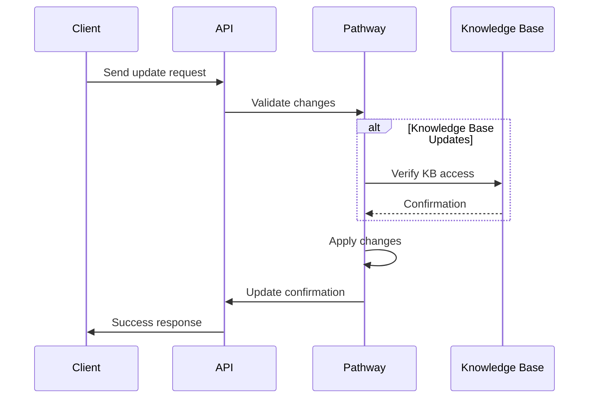

#### Example Updates

1. **Adding a New Node with KB**
```json
{
    "pathway_id": "path_123",
    "nodes": {
        "existing_node": {
            // ... existing node config ...
        },
        "new_objection_handler": {
            "name": "Price Objection Handler",
            "type": "Default",
            "prompt": "Handle price objections using knowledge base",
            "tools": ["KB-pricing-123"]
        }
    },
    "edges": {
        "new_edge": {
            "source": "existing_node",
            "target": "new_objection_handler",
            "label": "Price Objection"
        }
    }
}
```

2. **Updating Node Prompts**
```json
{
    "node_id": "value_prop_node",
    "updates": {
        "prompt": "Present value proposition focusing on ROI. Use KB for specific examples.",
        "tools": ["KB-roi-examples", "KB-case-studies"]
    }
}
```

3. **Modifying Flow Logic**
```json
{
    "pathway_id": "path_123",
    "edges": {
        "edge_1": {
            "source": "qualification",
            "target": "objection_handler",
            "label": "Needs More Info"
        },
        "edge_2": {
            "source": "qualification",
            "target": "closing",
            "label": "Ready to Buy"
        }
    }
}
```

#### Update Validation Rules

1. **Node Updates**
- Cannot remove start node
- Must maintain at least one end node
- Knowledge base tools must exist and be accessible
- Prompts must be non-empty

2. **Edge Updates**
- No circular references
- All nodes must be reachable from start
- All paths must lead to an end node
- Source and target nodes must exist

3. **Knowledge Base Updates**
- KBs must be initialized before linking
- Node prompts should reference linked KBs
- Multiple KBs per node allowed

#### Error Handling

```typescript
interface UpdateError {
    code: string;
    message: string;
    details: {
        location: string;     // Where the error occurred
        expected: string;     // Expected value/condition
        received: string;     // Received value/condition
    };
}

// Example error response
{
    "error": {
        "code": "INVALID_KB_REFERENCE",
        "message": "Knowledge base not found or inaccessible",
        "details": {
            "location": "nodes.objection_handler.tools[0]",
            "expected": "Valid KB ID",
            "received": "KB-nonexistent-123"
        }
    }
}
``` 